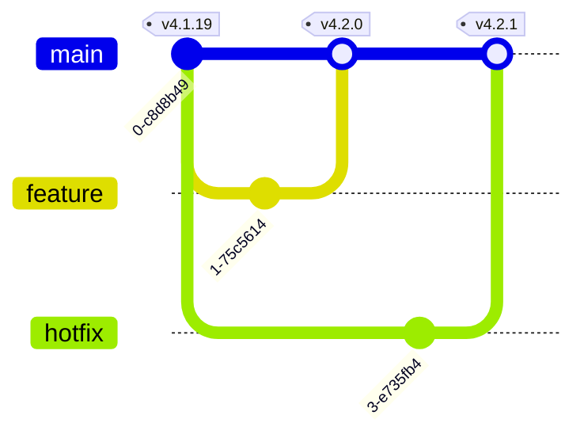
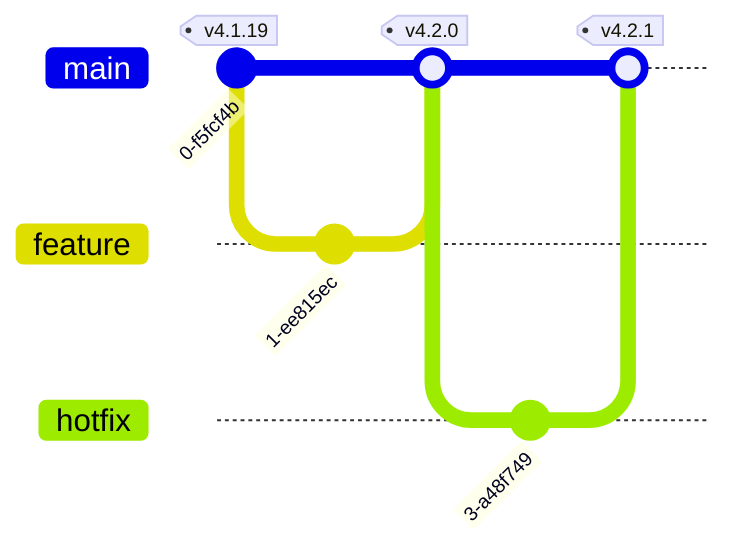
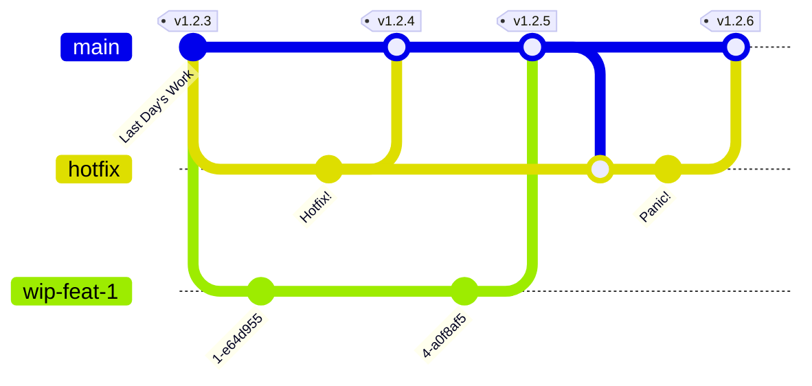
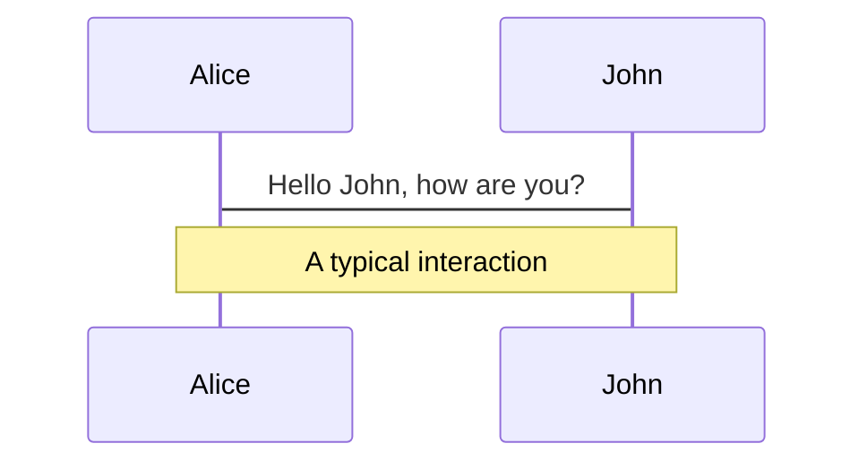
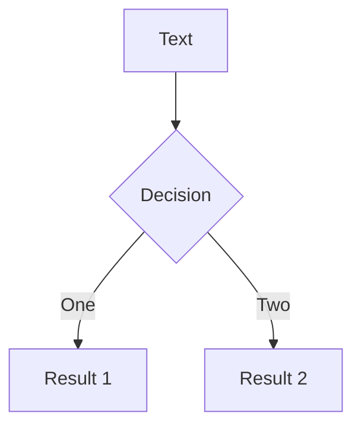
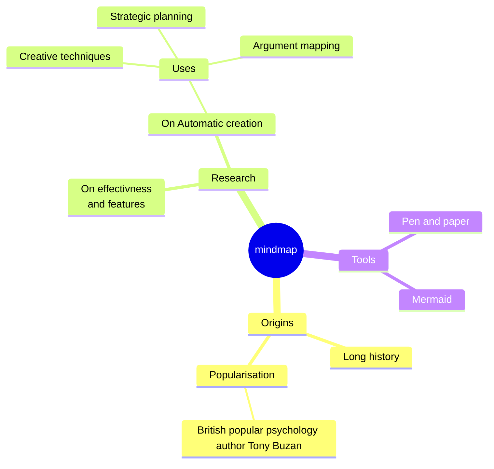
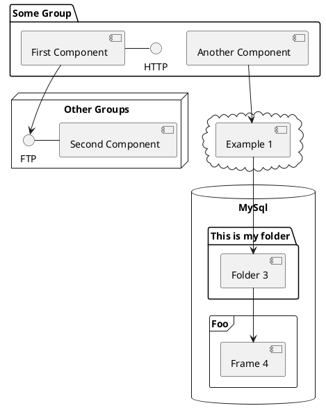

# Feature Flags / Toggles

Often Hinted at. Seldom Introduced


<!--
You're probably already reflecting on the concept if you haven't already done your own implementation of it...
-->

---
layout: center
---

# $ whoami

---
hideInToc: true
layout: default
---

# Table of contents

<Toc maxDepth="1"></Toc>

---
layout: section
---

# What are Feature Flags?

---
hideInToc: true
level: 2
layout: center
transition: slide-up
---

# What are Feature Flags

```ts
if (FLAG) {
    // Feature
}
```

> A condition within the code enables or disables a feature during runtime

[Wikipedia](https://en.wikipedia.org/wiki/Feature_toggle)

---
layout: two-cols-header
level: 2
transition: slide-up
---

# Terminology: Features ...

::left::

## Flags

Launchtime

Simpler

::right::

## Toggles / Switches

Runtime

Features++

---
layout: center
level: 2
---

# What aren't Feature Flags

- Country/Region Selectors
- Dark Mode
- Language Selectors

---
layout: section
transition: slide-up
---

# Why Use Feature Flags?

- Product / Feature Identification
- Continuous Integration
- Decouple Deployment from Release
- Environment-Specific Feature Sets
  - Pre-release UATs

---
layout: center
level: 2
transition: slide-up
---

# Product Identification


image: [NVidia](https://nvidia.com)

---
layout: two-cols-header
level: 2
transition: slide-up
---

# Decouple Deployment from Release

- You're releasing a new feature, say `v4.2.0`.
- It's promply rolled back.
- Customer Support escalates an _unrelated_ important bug that was present prior to `v4.1.19` releases
- Which version will you hotfix?

::left::



::right::


::bottom::

_I sense a meeting in your near future..._

---
layout: center
level: 2
transition: slide-up
---
# Continuous Integration



---

# Navigation

Hover on the bottom-left corner to see the navigation's controls panel, [learn more](https://sli.dev/guide/navigation.html)

## Keyboard Shortcuts

|     |     |
| --- | --- |
| <kbd>right</kbd> / <kbd>space</kbd>| next animation or slide |
| <kbd>left</kbd>  / <kbd>shift</kbd><kbd>space</kbd> | previous animation or slide |
| <kbd>up</kbd> | previous slide |
| <kbd>down</kbd> | next slide |

<!-- https://sli.dev/guide/animations.html#click-animations -->

<p v-after class="absolute bottom-23 left-45 opacity-30 transform -rotate-10">Here!</p>

---
layout: image-right
image: https://source.unsplash.com/collection/94734566/1920x1080
---

# Code

Use code snippets and get the highlighting directly, and even types hover![^1]

```ts {all|5|1-6|9|all} twoslash
// TwoSlash enables TypeScript hover information and errors in markdown code blocks
// Learn more at https://www.typescriptlang.org/dev/twoslash/
function getUser(id: number): User {
  return undefined as any
}
function saveUser(id: number, user: User) {
  // ...
}
// ---cut---
interface User {
  id: number
  firstName: string
  lastName: string
  role: string
// ^?
}

function updateUser(id: number, update: User) {
  const user = getUser(id)
  const newUser = { ...user, ...update }
  saveUser(id, newUser)
}
```

<arrow v-click="[3, 4]" x1="400" y1="420" x2="230" y2="330" color="#564" width="3" arrowSize="1" />

[^1]: [Learn More](https://sli.dev/guide/syntax.html#line-highlighting)

<style>
.footnotes-sep {
  @apply mt-20 opacity-10;
}
.footnotes {
  @apply text-sm opacity-75;
}
.footnote-backref {
  display: none;
}
</style>

---

# Components

<div grid="~ cols-2 gap-4">
<div>

You can use Vue components directly inside your slides.

We have provided a few built-in components like `<Tweet/>` and `<Youtube/>` that you can use directly. And adding your custom components is also super easy.

```html
<Counter :count="10" />
```

<!-- ./components/Counter.vue -->
<Counter :count="10" m="t-4" />

Check out [the guides](https://sli.dev/builtin/components.html) for more.

</div>
<div>

```html
<Tweet id="1390115482657726468" />
```

<Tweet id="1390115482657726468" scale="0.65" />

</div>
</div>

<!--
Presenter note with **bold**, *italic*, and ~~striked~~ text.

Also, HTML elements are valid:
<div class="flex w-full">
  <span style="flex-grow: 1;">Left content</span>
  <span>Right content</span>
</div>
-->

---
class: px-20
---

# Themes

Slidev comes with powerful theming support. Themes can provide styles, layouts, components, or even configurations for tools. Switching between themes by just **one edit** in your frontmatter:

<div grid="~ cols-2 gap-2" m="t-2">

```yaml
---
theme: default
---
```

```yaml
---
theme: seriph
---
```


</div>

Read more about [How to use a theme](https://sli.dev/themes/use.html) and
check out the [Awesome Themes Gallery](https://sli.dev/themes/gallery.html).


---

# Diagrams

You can create diagrams / graphs from textual descriptions, directly in your Markdown.

<div class="grid grid-cols-4 gap-5 pt-4 -mb-6">









</div>

[Learn More](https://sli.dev/guide/syntax.html#diagrams)

---
src: ./pages/multiple-entries.md
hide: false
---

---
layout: center
class: text-center
---

# Learn More

[Documentations](https://sli.dev) · [GitHub](https://github.com/slidevjs/slidev) · [Showcases](https://sli.dev/showcases.html)
