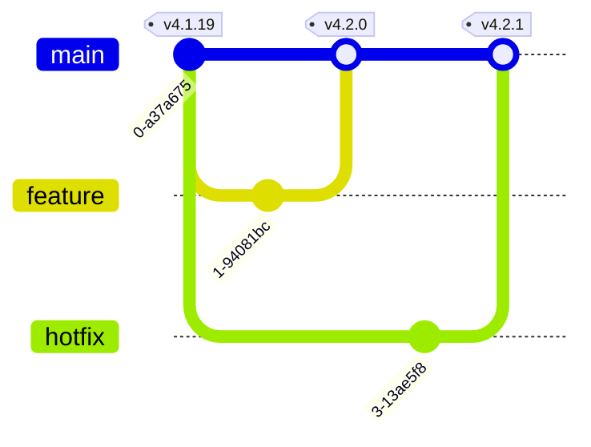
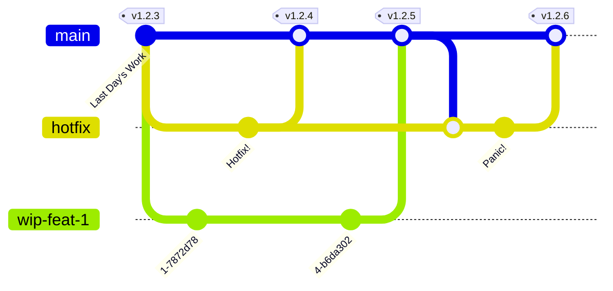
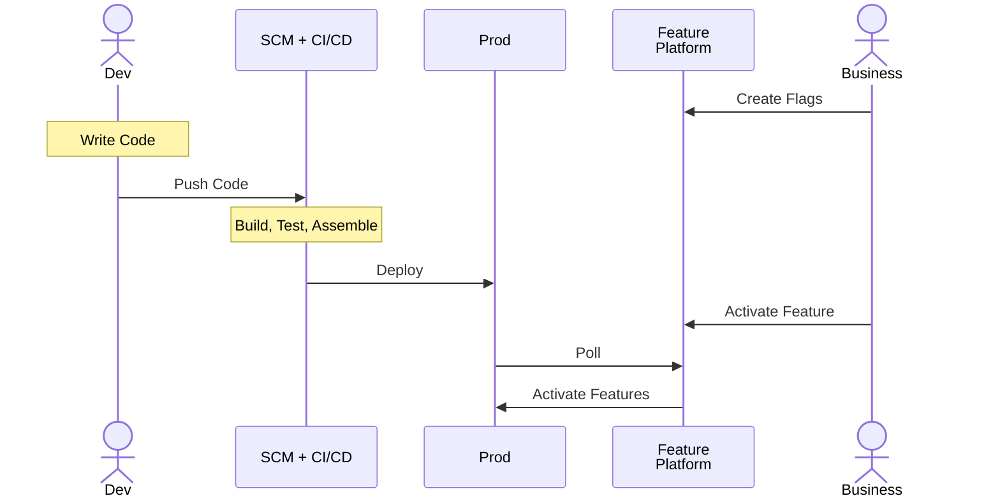
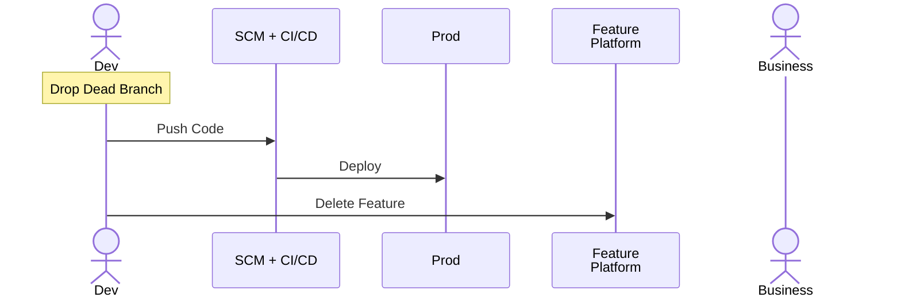

# Feature Flags / Toggles

Often Hinted at. Seldom Introduced


<!--
You're probably already reflecting on the concept if you haven't already done your own implementation of it...
-->

---
layout: center
---

# $ whoami

---
hideInToc: true
layout: default
---

# Table of contents

<Toc maxDepth="1"></Toc>

---
layout: section
---

# What are Feature Flags?

---
hideInToc: true
level: 2
layout: center
transition: slide-up
---

# What are Feature Flags

```ts
if (FLAG) {
    // Feature
}
```

> A condition within the code enables or disables a feature during runtime

[Wikipedia](https://en.wikipedia.org/wiki/Feature_toggle)

---
layout: two-cols-header
level: 2
transition: slide-up
---

# Terminology: Features ...

::left::

## Flags

Launchtime

Simpler

::right::

## Toggles / Switches

Runtime

Features++

---
layout: center
level: 2
---

# What aren't Feature Flags

- Country/Region Selectors
- Dark Mode
- Language Selectors

---
layout: section
transition: slide-up
---

# Why Use Feature Flags?

- Product / Feature Identification
- Continuous Integration
- Decouple Deployment from Release
- Environment-Specific Feature Sets
- Pre-release UATs

---
layout: center
level: 2
transition: slide-up
---

# Product Identification


image: [NVidia](https://nvidia.com)

---
layout: two-cols-header
level: 2
transition: slide-up
---

# Decouple Deployment from Release

- You're releasing a new feature, say `v4.2.0`.
- It's promply rolled back.
- Customer Support escalates an _unrelated_ important bug that was present prior to `v4.1.19` releases
- Which version will you hotfix?

::left::



::right::


::bottom::

_I sense a meeting in your near future..._

<!--
You can probably get out of this quandary by creating a new 4.1 feature-branch and fight all your other automation
It's still far from ideal as as your automation is still primed to release v4.2.1 over v4.1.20
-->

---
layout: center
level: 2
transition: slide-up
---
# Continuous Integration



---
layout: center
level: 2
transition: slide-up
---

# Killswitches

---
layout: center
level: 2
transition: slide-left
---

# Canary Releases

---
layout: section
---

# Homemade Alternatives to Feature Flags Platforms

---
level: 2
---
# Hardware

- Soldered Components
- Switches


Image: [Raymond Spekking](https://en.wikipedia.org/wiki/File:Nedap_ESD1_-_printer_controller_-_DIP_switch_-_all_off-91979.jpg)

---
layout: two-cols-header
level: 2
---

# Software

## Access Control

::left::
- Works when developing *new* features/components
- Enables Canary Releases
::right::
- Loses its utility when the feature is released
- Can only handle feature overhauls by treating them as new features

---
level: 3
---

## Configuration Options

- "Compiler" Flags
  + Once and Done
  - Requires Better Artifacts Versionning
- Environment Variables / Configuration Files
  + No External Dependencies
  + Allows for Environment-Specific Flags
  - Might need to use IaC/CaC 

---
level: 3
---

# In-House Platform

- Probably meets your current needs
- **Are you in the business of selling Feature Toggles Platforms?**

---
level: 1
layout: section
---

# Let's Decouple Features From Versions!

---
level: 2
---



---
level: 2
---
# Drop Dead Branch

