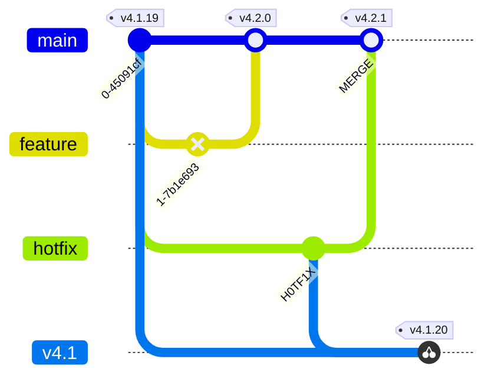

# Feature Flags / Toggles

Often Hinted at. Seldom Introduced

Level: Beginner


<!--
You're probably already reflecting on the concept if you haven't already done your own implementation of it...
-->

---
hideInToc: true
layout: center
---

# Disclaimer

This talk isn't sponsored by Unleash.

Unleash was picked due to the availability of a live web demo and the ability to self host.

---
hideInToc: true
layout: two-cols-header
---

# $ whoami

[SOAR](https://en.wikipedia.org/wiki/Security_orchestration) Dev/Sec/Ops @ Desjardins  
Formerly DecSecOps @ FOCUS

::left::
- 10 Hosts / 50 Services
- < 5 transactions/s
- 1 environment
- < 1 deployment/week
- ~5k IoT Devices
- 5th dev

::right::
- 100 Hosts / 400 Services
- 100 transactions/s
- 10 environments
- 200 deployments/day
- ~50k IoT Devices
- 15 devs

::bottom::
This is the talk I wish I'd have heard at ConFoo whilst we were speeding up

---
hideInToc: true
layout: default
---

# Table of contents

<Toc maxDepth="1"></Toc>

---
layout: section
---

# What are Feature Flags?

---
hideInToc: true
level: 2
layout: center
---

# What are Feature Flags

> A condition within the code enables or disables a feature during runtime

[Wikipedia](https://en.wikipedia.org/wiki/Feature_toggle)

```ts
if (FLAG) {
    // Feature
}
```

---
layout: two-cols-header
level: 2
---

# Terminology: Features ...

::left::

## Flags

Launchtime

Simpler

::right::

## Toggles / Switches

Runtime

Features ++

::bottom::

Informally, all are used interchangeably

---
layout: center
level: 2
---

# What aren't Feature Flags

- User-Selectable Configuration
  - Country/Region Selectors
  - Dark Mode
  - Language Selectors
- Your Admin Dashboard

---
layout: center
level: 2
---

# What shouldn't Be  Behind Feature Flags

- Bugfixes
- Everything
  - The Kitchen Sink

---
layout: section
---

# Homemade Alternatives to Feature Toggles Platforms

<!-- This is all well and good, but I/we've already solved this issue internally! -->

---
layout: two-cols-header
level: 2
---

## Configuration Options

::left::
## "Compiler" Flags
  + Once and Done
  - Requires Better Artifacts Versionning

::right::
## Environment Variables / Configuration Files
  + No External Dependencies
  + Allows for Environment-Specific Flags
  - Might need to use IaC/CaC

---
layout: two-cols-header
level: 2
---

# Software

## Access Control

::left::
## Pros
- Works when developing *new* features/components
- Enables Canary Releases
::right::

## Cons
- Loses its utility once the feature is released
- Can only handle feature overhauls by treating them as new features

---
layout: two-cols-header
level: 2
---

# In-House Platform

::left::
# Pros
- Probably meets your current needs
- Might meet your **very complex** needs
- Might have to handle _sensitive_ data

::right::
# Cons
- Or Does it?
- **Are you in the business of selling Feature Toggles Platforms?**

- Does it support the [Open Feature](https://openfeature.dev/) spec?

---
layout: center
transition: slide-up
---

# Why Use Feature Flags?

- Product / Feature Identification
- Continuous Integration
- Decouple Deployment from Release
- Environment-Specific Feature Sets
- Pre-release UATs

---
layout: two-cols-header
level: 2
transition: slide-up
---

# Product Identification

::left::

image: [NVidia](https://nvidia.com)

::right::


Image: [Raymond Spekking](https://en.wikipedia.org/wiki/File:Nedap_ESD1_-_printer_controller_-_DIP_switch_-_all_off-91979.jpg)

::bottom::
<!---->

---
layout: two-cols-header
level: 2
---

# Decouple Deployment from Release

::left::
## Going past _big bang_ releases

- Rolling Release
- Canaries
- A/B Testing
- ...

::right::
## Business Constraints

- If you have to release a feature at a given date.
  - Murphy's Law will fail your merge/deployment
  - Better to have the code ready in prod
- If you have regulatory frameworks to follow

---
layout: two-cols-header
level: 2
transition: slide-left
---

# Rolling Releases

::left::


::right::


::bottom::

Pitfall: There's a special kind of emergent failure modes in your changes when using rolling release

---
layout: two-cols-header
level: 2
---

# Example Transient Rollover Failure Window

::left::


::right::

|id|Server|X|Y|Odo|Expected Odo|
|---|---|---|---|---|---|
|0|2|0|1|0|0|
|1|1|1|1|null|1|
|2|2|2|1|2|2|
|3|1|2|2|null|3|
|4|2|3|2|3.44|4|

::bottom::
On distributed systems, non-breaking changes may cause unexpected behaviors when being progressively released, **if they rely on data processed by other instances**

---
level: 2
---

# Transient Rollover Failure Window


---
image: ./imgs/killswitch.jpg
layout: image-right
level: 2
transition: slide-up
---

# Killswitches

Think of Feature Flags.  
Used the Other Way Around

image: [Stahlkocher](https://en.wikipedia.org/wiki/File:Not-Aus_Bet%C3%A4tiger.jpg)

---
level: 2
---

# UATs

Most modern Feature Flags System Implementation offer environment management.

It is trivial to flag an environment for UAT for a given feature.

Note: Unleash Free/Self-Hosted is limited to Dev/Prod Environments

---
layout: two-cols-header
level: 2
---

# Storytime: When CD gets ahead of the Team!

<!--For Simplicity's Sake, this Demo is made using gitgraph of a project-->

- You're releasing a new feature, say `v4.2.0`.
- It's promply rolled back.
- Customer Support escalates an _unrelated_ important bug that was present prior to `v4.1.19` releases
- Which version will you hotfix?

::left::


::right::


::bottom::

_I sense a meeting in your near future..._

<!--
You can probably get out of this quandary by creating a new 4.1 feature-branch and fight all your other automation
It's still far from ideal as as your automation is still primed to release v4.2.1 over v4.1.20
-->

---
level: 2
---

# You could create a version branch



<!-- You could always create a new release branch to release a specially doctored hotfix -->

---
layout: default
level: 2
transition: none
---

# Your CD is still primed to release 


<!-- However, your CI/CD is still primed to release the next version -->

---
layout: default
level: 2
---

# Now, your team has to work on the version branch...


<!-- By now, you're probably already tired of fighting your CI/CD -->

---
layout: section
hideInToc: true
transition: slide-up
---

# Using Unleash Platform

<!-- You Suffered Enough! Time for me to put my money where my mouth is! -->

---
layout: center
level: 2
---


Source: [Unleash](https://getunleash.io)

---
layout: center
level: 2
---

# Install Dependencies
```sh
npm i koa unleash-client
npm i -D @types/koa typescript
```

---
layout: center
level: 2
transition: none
---

# Sample KoaFoo App

```ts 
import Koa from 'koa'

const app = new Koa();

// response
app.use(ctx => {
  ctx.body = 'Hello ConFoo YUL 2024!';
});

app.listen(3000);
```

---
layout: center
level: 2
transition: none
---

# Plug in Unleash
# & **Definitely** Functionnal New Feature

```ts {2,6-10,16-18|2|6-10|16-18|*}
import Koa from 'koa'
import { startUnleash } from 'unleash-client';

const app = new Koa();

const unleash = await startUnleash({
    url: 'https://YOUR-API-URL',
    appName: 'my-node-name',
    customHeaders: { Authorization: 'SOME-SECRET' }
})

// response
app.use(ctx => {
  ctx.body = 'Hello ConFoo YUL 2024!';

  if (unleash.isEnabled("I-Did-Not-Break-This-Demo")) {
    throw new Error("Works On My Machine(TM)!")
  }
});

app.listen(3000);
```

---
layout: center
level: 2
---
# Demo  
- Self-Hosted Portal
- Add Flag
- http://localhost:3000

---
hideInToc: true
level: 1
layout: section
---

# Going Forward

---
layout: two-cols-header
level: 2
---

# Feature Flags Lifetime

::left::

## Release Flags

_As Short-Lived As Possible_

::right::

## Killswitches

Permanent

---
level: 2
---

# Best Pratices:

- Do not put business logic in your Toggles
- Do not put Confidential Information (eg: PII) in your toggles
- Instrument your feature branches
- Remove the dead branch
  - Or at least have a new ticket to do so at a later date
  - Also Prune / Archive old flags in your tracker

---
level: 2
---

# Release Strategies

<v-clicks>

- On/Off
- Progressive Rollout
- Custom Logic
  - Application
  - User
  - Environment
  - ...

</v-clicks>

<!--Unleash Provides you with a whole lot of release strategies. Pick the one that fits your needs-->

---

# Conclusion

- Make sure the solution you're using meets your needs
- Feature Flag Systems will help you smooth your release process when scaling
- Use as few features at a time as possible

---
layout: end
hideInToc: true
---

# Thank You!

## Questions?
## Comments?
## Insults?

Slides Deck: [https://github.com/carboneater/confoo-2024-feature-flags](https://github.com/carboneater/confoo-2024-feature-flags)